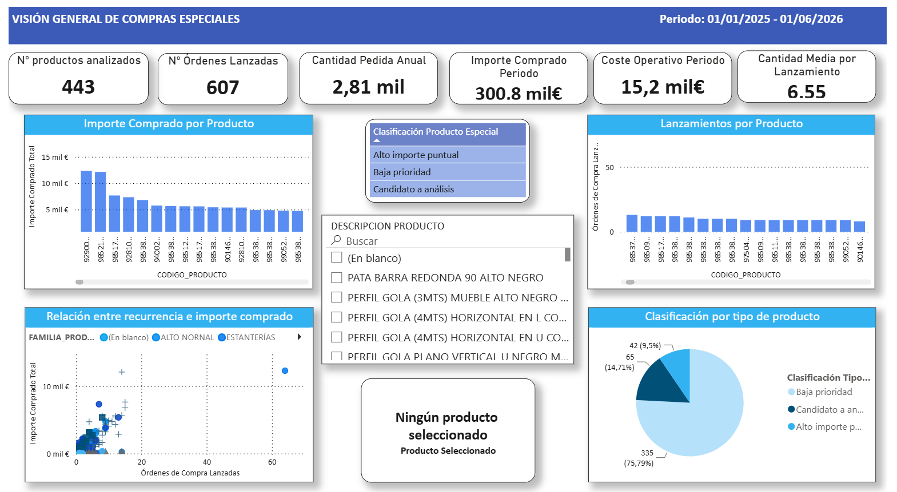
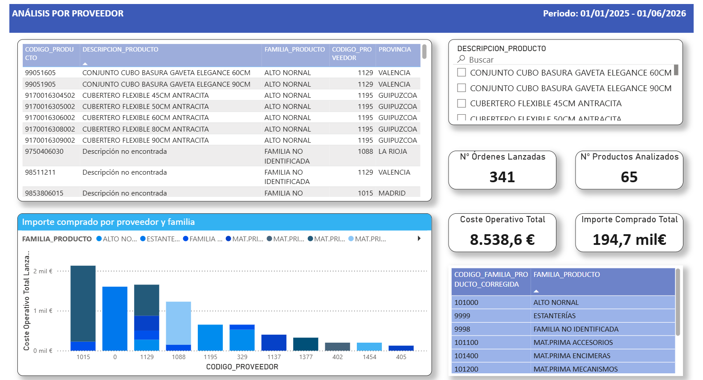
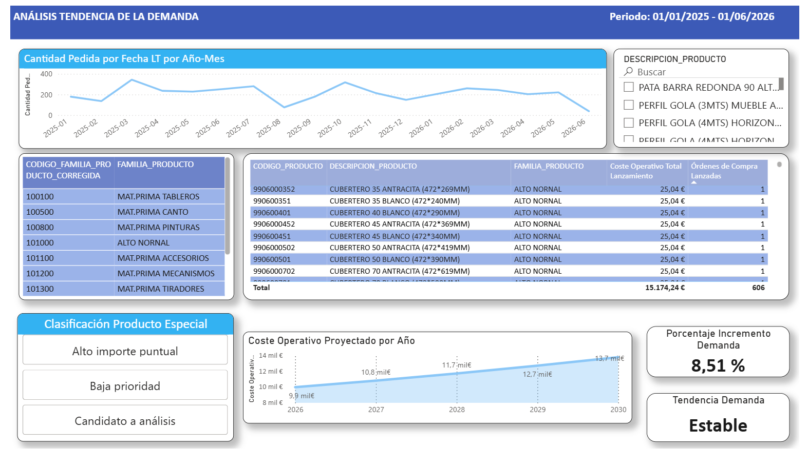
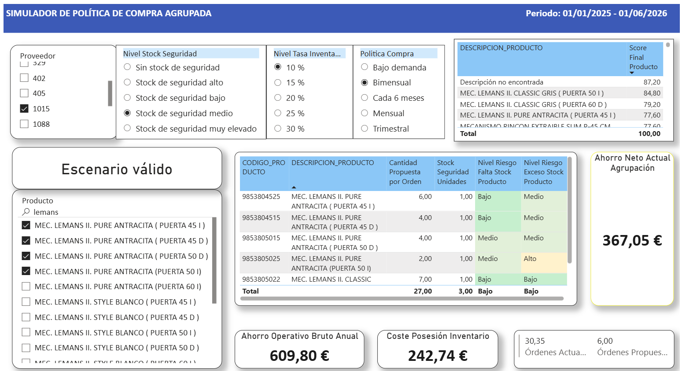

# Supply Chain Analytics — Simulador de compras agrupadas

Proyecto desarrollado durante el periodo de prácticas en **OB Cocinas**, orientado a construir una herramienta de apoyo a la decisión para el análisis y simulación de políticas de aprovisionamiento de productos especiales.

El modelo permite identificar productos candidatos a ser agrupados en órdenes de compra mediante un sistema de scoring individual por producto y comparar escenarios de compra en función de la frecuencia, el nivel de stock de seguridad, la tasa de posesión de inventario y el riesgo asociado.

## Herramientas utilizadas

- Power BI
- DAX
- Power Query
- SQL
- Excel

## Acceso al dashboard

**Dashboard interactivo en Power BI:**  
[Ver informe publicado](https://app.powerbi.com/view?r=eyJrIjoiNjljYWI1ODAtMWUxMi00YzY0LWE4ZmMtMjEyMDlkOWNkMGQ5IiwidCI6ImVmNGE2ODRlLTgxYjUtNDkxYy1hOThlLWM3YjMxYmU2YzQ2OSIsImMiOjh9)

También se puede escanear el siguiente QR para abrir el informe desde el móvil:

<p align="center">
  
</p>


> **Nota de confidencialidad:** los datos mostrados en la versión pública han sido anonimizados y modificados para proteger información empresarial. El problema de negocio, la metodología, la arquitectura del modelo y la lógica de análisis corresponden al proyecto desarrollado durante las prácticas.

## Problema de negocio

El proyecto nace del estudio de un proceso de compra reactivo para determinados productos denominados **productos especiales**. Estos productos son suministrados por proveedores de forma reactiva, es decir, se compran cada vez que se detecta que un pedido de cocina requiere una referencia concreta.

Cuando Ventas registra un pedido que incluye una necesidad especial, el área de Compras debe identificar la referencia, localizar o confirmar el proveedor, emitir la orden de compra y gestionar su seguimiento hasta la recepción y facturación.

La repetición de este proceso para pedidos de bajo volumen puede generar un número elevado de órdenes de compra y una carga operativa relevante. Además, el ERP no dispone de una clasificación completamente estructurada que separe de forma automática las compras rutinarias de las compras especiales.

Para construir el universo de análisis se utilizó como aproximación operativa un criterio de **cantidad pedida por línea igual o inferior a 5 unidades**, contrastado con el departamento de Compras como una forma razonable de identificar compras no rutinarias.

## Objetivo del proyecto

El objetivo fue desarrollar una herramienta en Power BI capaz de evaluar si determinados productos podían pasar de una compra estrictamente bajo demanda a políticas de aprovisionamiento planificadas y agrupadas por proveedor.

El simulador permite comparar el equilibrio entre:

- reducción del número de órdenes de compra;
- ahorro operativo asociado a los lanzamientos evitados;
- incremento del inventario generado por ciclos de compra más largos;
- riesgo potencial de falta o exceso de stock.

## Arquitectura y flujo del proyecto

```text
ERP → SQL → Excel / Power Query → Modelo Power BI → DAX → Scoring → Simulador → Apoyo a la decisión
```

## Visión general del dashboard

La primera página del informe muestra una visión general de las compras especiales. Sirve como contexto inicial para entender el volumen de productos analizados, el número de órdenes lanzadas, el importe comprado, el coste operativo asociado y la clasificación inicial de los productos.

<p align="center">
  
</p>

## Datos y preparación

El periodo analizado comprende del **01/01/2025 al 01/06/2026**. La información se obtuvo a partir del ERP mediante consultas e informes de compras. Posteriormente, los datos se transformaron y prepararon utilizando Excel y Power Query antes de incorporarlos al modelo analítico.

Durante la preparación aparecieron problemas habituales de calidad de datos, como referencias presentes en las compras que no estaban correctamente informadas en el maestro de productos. Para evitar perder trazabilidad se construyó una dimensión ampliada de productos y se completaron categorías auxiliares cuando fue necesario.

## Modelo de datos

El modelo combina tablas de hechos, dimensiones, calendario, una tabla puente de órdenes y tablas auxiliares. También se utilizaron tablas desconectadas para parametrizar el simulador sin introducir relaciones físicas innecesarias.

| Parámetro | Función en el simulador |
|---|---|
| Política de compra | Bajo demanda, mensual, bimensual, trimestral o cada 6 meses |
| Stock de seguridad | Sin stock, bajo, medio, alto o muy elevado |
| Tasa de posesión | Escenarios porcentuales seleccionables |
| Proveedor | Selección única |
| Productos | Selección múltiple dentro del proveedor seleccionado |

## Identificación de productos candidatos

Antes de construir el simulador se realizó un análisis descriptivo para estudiar recurrencia, importe, proveedor, familia y comportamiento temporal. Se estableció un mínimo de **5 órdenes de compra** como criterio inicial para considerar un producto candidato, complementándolo con información económica y de demanda.

El objetivo de esta fase fue reducir el universo de análisis y centrar el estudio en referencias con suficiente recurrencia como para justificar una política distinta de aprovisionamiento.

## Análisis por proveedor y tendencia de demanda

La hoja de análisis por proveedor permite estudiar el volumen de productos y órdenes lanzadas por proveedor. Esto facilita identificar aquellos proveedores con mayor margen potencial para la agrupación de productos.

<p align="center">
  
</p>

La hoja de tendencia de demanda estudia el comportamiento temporal de cada producto o familia de productos. Esto permite identificar referencias con tendencia positiva, estable o decreciente, información relevante para decidir si una política de compra planificada puede ser adecuada.

<p align="center">
  
</p>

## Sistema de scoring

Para evitar que la selección de productos dependiera únicamente del número de órdenes históricas, se desarrolló un sistema de puntuación que combina características del producto y del proveedor.

El **score individual del producto** considera cinco bloques:

- ahorro operativo potencial;
- recurrencia temporal;
- estabilidad de la demanda;
- tendencia de consumo;
- periodos consecutivos sin demanda.

El **score del proveedor** incorpora la concentración de productos candidatos, órdenes y carga operativa. El resultado final asigna un **80 % de peso al comportamiento individual del producto** y un **20 % al contexto del proveedor**.

```DAX
Score Individual Producto =
    [Puntos Ahorro Operativo Producto]
    + [Puntos Recurrencia Temporal]
    + [Puntos Estabilidad Demanda]
    + [Puntos Tendencia Demanda]
    + [Puntos Huecos Sin Demanda]
```

```DAX
Score Final Producto =
VAR ScoreIndividual =
    [Score Individual Producto]
VAR ScoreProveedor =
    [Score Proveedor Agrupación]
RETURN
    (ScoreIndividual * 0.8)
    + (ScoreProveedor * 0.2)
```

Uno de los componentes del score utiliza el coeficiente de variación para convertir la estabilidad de la demanda en una puntuación:

```DAX
Puntos Estabilidad Demanda =
VAR CV =
    [Coeficiente Variación Demanda Producto]
RETURN
    SWITCH(
        TRUE(),
        ISBLANK(CV), 0,
        CV <= 0.50, 20,
        CV <= 0.80, 16,
        CV <= 1.20, 10,
        CV <= 1.80, 5,
        0
    )
```

## Simulador de políticas de compra

La parte principal del proyecto es un simulador interactivo que permite sustituir parcialmente una compra reactiva bajo demanda por una política de aprovisionamiento planificada. El usuario selecciona un proveedor, una frecuencia de compra, el nivel de stock de seguridad, la tasa de posesión de inventario y los productos que desea incluir.

A partir de esa configuración, el modelo recalcula las cantidades propuestas por orden, el número de lanzamientos, el coste operativo, el coste de posesión de inventario y los indicadores de riesgo. La finalidad no es agrupar necesidades ya recibidas, sino anticipar compras utilizando el comportamiento histórico de la demanda.

En la tabla superior derecha aparecen los productos del proveedor seleccionado ordenados de mayor a menor score. De esta forma se puede construir el escenario de agrupación empezando por los productos con mayor puntuación.

<p align="center">
  
</p>

## Sección técnica: DAX y lógica del simulador

La lógica del modelo se construyó mediante medidas DAX encadenadas. Los cálculos se separan en componentes reutilizables para demanda, recurrencia, scoring, inventario y riesgo, de forma que los parámetros seleccionados por el usuario puedan modificar dinámicamente el escenario.

### Cantidad propuesta por orden

La cantidad propuesta responde a la política seleccionada, a la demanda media mensual, a la duración del ciclo y al nivel de stock de seguridad. En compra bajo demanda se mantiene como referencia la cantidad media histórica por orden.

```DAX
Cantidad Propuesta por Orden =
VAR Politica =
    [Política Compra Seleccionada]
VAR DemandaMensual =
    [Demanda Media Mensual Producto]
VAR MesesCiclo =
    [Meses Ciclo Seleccionados]
VAR CoefSeguridad =
    [Coeficiente Seguridad Seleccionado]
VAR CantidadBase =
    DemandaMensual * MesesCiclo
VAR CantidadConSeguridad =
    CantidadBase * (1 + CoefSeguridad)
RETURN
    IF(
        Politica = "Bajo demanda",
        [Cantidad Media por Orden Producto],
        ROUNDUP(CantidadConSeguridad, 0)
    )
```

### Coste de posesión de inventario

El coste de posesión de la agrupación se calcula producto a producto dentro del contexto de selección actual. Esto permite que el resultado responda a los productos elegidos por el usuario y no a un agregado estático.

```DAX
Coste Posesión Inventario Anual Agrupación =
VAR Politica =
    [Política Compra Seleccionada]
RETURN
    IF(
        Politica = "Bajo demanda",
        0,
        SUMX(
            VALUES(PRODUCTOS_COMPLETOS[CODIGO_PRODUCTO]),
            [Coste Posesión Inventario Anual]
        )
    )
```

### Indicadores heurísticos de riesgo

El riesgo de falta de stock se representa mediante un índice heurístico de 0 a 100. No pretende estimar una probabilidad estadística exacta; su finalidad es comparar escenarios utilizando información de ciclo de compra, variabilidad, tendencia, picos históricos y stock de seguridad.

```DAX
Riesgo Falta Stock Producto =
VAR Politica = [Política Compra Seleccionada]
VAR MesesCiclo = [Meses Ciclo Seleccionados]
VAR CV = [Coeficiente Variación Demanda Producto]
VAR CoefSeguridad = [Coeficiente Seguridad Seleccionado]
VAR RiesgoCiclo =
    SWITCH(
        TRUE(),
        Politica = "Bajo demanda", 0,
        MesesCiclo <= 1, 4,
        MesesCiclo <= 2, 8,
        MesesCiclo <= 3, 16,
        MesesCiclo <= 6, 30,
        45
    )
VAR RiesgoVariabilidad =
    SWITCH(
        TRUE(),
        ISBLANK(CV), 5,
        CV <= 0.50, 2,
        CV <= 0.80, 6,
        CV <= 1.20, 12,
        CV <= 1.80, 20,
        28
    )
VAR ReduccionStockSeguridad =
    SWITCH(
        TRUE(),
        CoefSeguridad = 0, 0,
        CoefSeguridad <= 0.05, 8,
        CoefSeguridad <= 0.10, 16,
        CoefSeguridad <= 0.20, 26,
        36
    )
VAR RiesgoFinal =
    RiesgoCiclo
    + RiesgoVariabilidad
    + [Puntos Riesgo Tendencia]
    + [Puntos Riesgo Pico Demanda]
    + [Puntos Riesgo Histórico Insuficiente]
    - ReduccionStockSeguridad
RETURN
    MIN(100, MAX(0, RiesgoFinal))
```

De forma complementaria se desarrolló un segundo índice para el riesgo de exceso de stock, que penaliza ciclos largos, niveles elevados de seguridad, tendencias decrecientes y huecos prolongados sin demanda.

## Cálculo económico

Para estimar el impacto de reducir lanzamientos se calculó un coste operativo directo por orden mediante un enfoque basado en actividades. En el simulador se utiliza un coste directo estimado de **25,04 € por lanzamiento**.

Los costes fijos estructurales se analizan por separado y no se utilizan como ahorro incremental, ya que no desaparecen necesariamente al reducir el número de órdenes.

```text
Ahorro operativo bruto = Órdenes evitadas × 25,04 €
Ahorro neto anual = Ahorro operativo bruto − Coste de posesión de inventario
```

El propósito del cálculo no es garantizar que una política agrupada genere ahorro. Un escenario puede reducir de forma importante el número de órdenes y, aun así, resultar poco atractivo si el incremento del inventario supera el ahorro operativo.

## Resultados y conclusión

El principal resultado del proyecto fue el desarrollo de una herramienta de análisis y simulación para apoyar la toma de decisiones en el aprovisionamiento de productos especiales.

El modelo permite pasar de un análisis puramente descriptivo de las compras históricas a un entorno interactivo en el que es posible identificar productos candidatos, evaluar su idoneidad para políticas de compra planificada y comparar diferentes escenarios de aprovisionamiento.

La herramienta integra en una misma decisión variables operativas y económicas como la frecuencia de compra, la reducción de órdenes, las cantidades propuestas, el stock de seguridad, el coste de posesión de inventario y los riesgos de falta o exceso de stock.

El objetivo del simulador no es determinar automáticamente qué política debe aplicar el departamento de Compras, sino proporcionar una base cuantitativa para comparar alternativas y entender las consecuencias de cada decisión.

Desde el punto de vista técnico, el proyecto permitió aplicar de forma integrada SQL, Power Query, modelado de datos, DAX y Power BI sobre un problema real de Supply Chain, cubriendo el proceso desde la extracción y preparación de datos hasta el desarrollo de una herramienta interactiva de apoyo a la decisión.

## Limitaciones y siguientes pasos

La herramienta tiene varias limitaciones que serían relevantes en una siguiente fase:

- no incorpora el stock actual disponible en almacén;
- no integra previsiones comerciales futuras;
- los indicadores de riesgo son heurísticos y dependen de la calidad del histórico;
- no considera mínimos de compra, descuentos por volumen o restricciones contractuales específicas;
- el lead time de proveedor no forma parte del cálculo final del simulador.

Como evolución futura, el modelo podría incorporar:

- stock real actualizado;
- integración directa con el ERP;
- previsiones de demanda;
- lead times de proveedor;
- una clasificación formal del tipo de compra en el ERP;
- validación y ajuste de umbrales junto con responsables de Compras.


